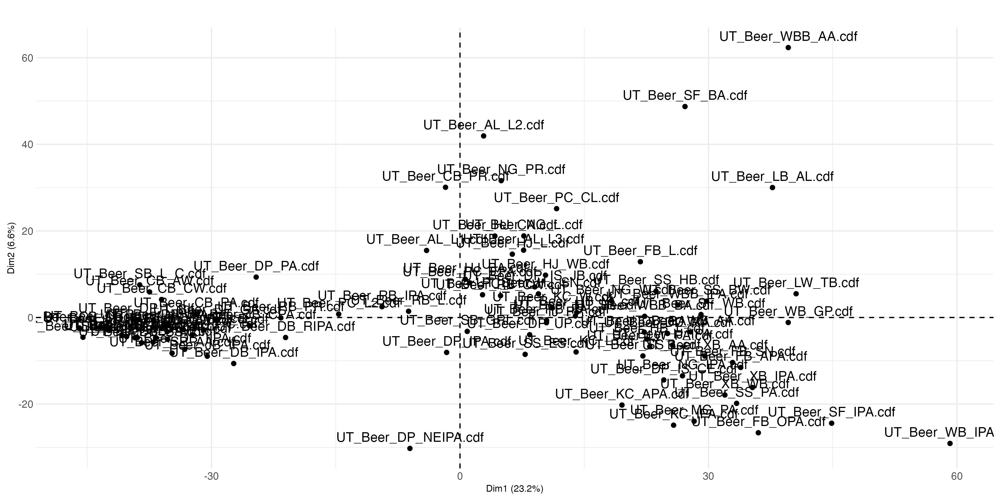

# Comparing the difference between retention time and mass-to-charge profiles

In this section we look at the different profiles we get from the two sets of extracted data using multivariate analysis. 
The example is from GC-MSMS analysis on a beer set of 90 samples.
Analysis was done in R.

## Libraries needed to run the code

```
  library("ncdf4")
  library("tidyverse")
  library("hrbrthemes")
  library("htmlwidgets")
  library("FactoMineR") # For producing  PCA
  library("factoextra") # Additional visualization commands using fviz
```

## read the data from the previous extraction

```
rt_data <- bind_rows(tic_list, .id = "data_frame")
  rt_data <-
    pivot_wider(
      rt_data,
      names_from = "Retention_time_min",
      values_from = "total_intensity",
      values_fill = 0
    )
  # Always remember to set the sample names as the index in order to run the PCA with desired labels
  rt_data <- rt_data %>% column_to_rownames("data_frame")
  mz_data <- bind_rows(mz_list, .id = "data_frame")
  mz_data <-
    pivot_wider(
      mz_data,
      names_from = "mass_value",
      values_from = "intensity_values",
      values_fn = sum
    )
  mz_data <- mz_data %>% column_to_rownames("data_frame")

```

## plot the scores for retention time and mass-to-charge seperately

```
beer_rt_pca <- PCA(rt_data, graph = FALSE)
  beer_rt_pca_scores <- fviz_pca_ind(
    beer_rt_pca,
    axes = c(1, 2),
    repel = FALSE,
    addEllipses = FALSE,
    ellipse.level = 0.95,
    col.ind = "black",
    title = "",
    palette = "rickandmorty"
  ) +
    geom_point(colour = "black",
               size = 1,
               shape = 19) +
    theme(
      axis.text.x = element_text(
        angle = 0,
        hjust = 0.5,
        vjust = 0.5
      ),
      axis.title.x = element_text(
        hjust = 0.5,
        vjust = 0.5,
        size = 8
      ),
      axis.title.y = element_text(
        hjust = 0.5,
        vjust = 0.5,
        size = 8
      ),
      axis.ticks.length.x = unit(0, "cm"),
      axis.ticks.length.y = unit(0, "cm")
    )
  ggsave(
    "rt_pca_scores.jpg",
    plot = beer_rt_pca_scores,
    width = 30,
    height = 15,
    units = 'cm',
    dpi = 300
  )
  browseURL("rt_pca_scores.jpg")
```


```
  # MZ PCA
  beer_mz_pca <- PCA(mz_data, quali.sup = 1:1, graph = FALSE)
  beer_mz_pca_scores <- fviz_pca_ind(
    beer_mz_pca,
    axes = c(1, 2),
    repel = FALSE,
    addEllipses = FALSE,
    ellipse.level = 0.95,
    col.ind = "black",
    title = "",
    palette = "rickandmorty"
  ) +
    geom_point(colour = "black",
               size = 1,
               shape = 19) +
    theme(
      axis.text.x = element_text(
        angle = 0,
        hjust = 0.5,
        vjust = 0.5
      ),
      axis.title.x = element_text(
        hjust = 0.5,
        vjust = 0.5,
        size = 8
      ),
      axis.title.y = element_text(
        hjust = 0.5,
        vjust = 0.5,
        size = 8
      ),
      axis.ticks.length.x = unit(0, "cm"),
      axis.ticks.length.y = unit(0, "cm")
    )
  ggsave(
    "mz_pca_scores.jpg",
    plot = beer_mz_pca_scores,
    width = 30,
    height = 15,
    units = 'cm',
    dpi = 300
  )
  browseURL("mz_pca_scores.jpg")

```

  
  
# rv coefficients
to compare the two PCA, we caluclate the cofigurational similarity

```
  coeffRV(as.data.frame(beer_rt_pca$ind),as.data.frame(beer_mz_pca$ind))
  coeffRV(xcms_online_beer,beer_set_results)
   
```
