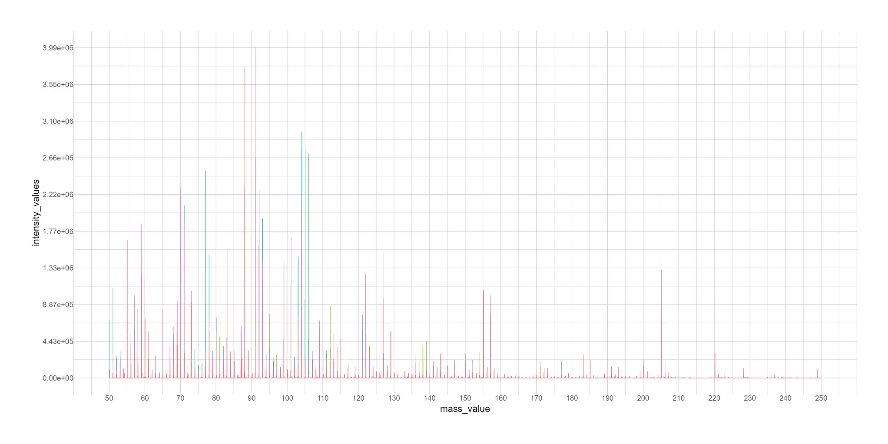
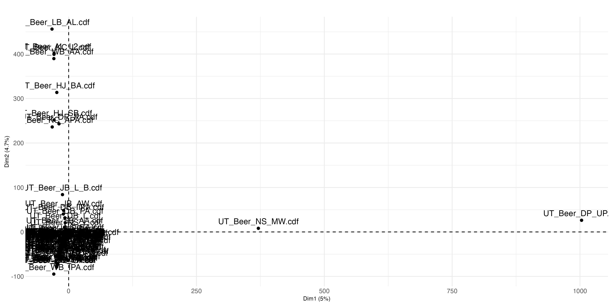
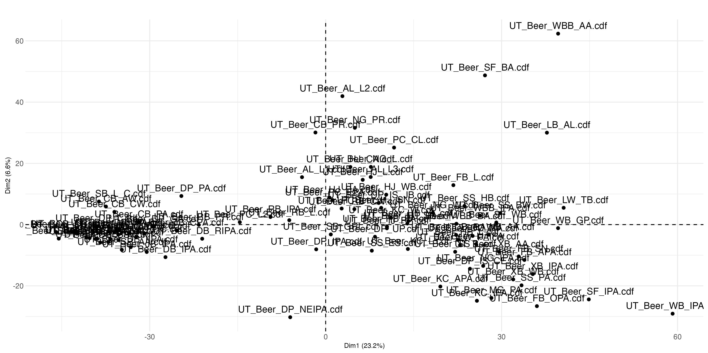
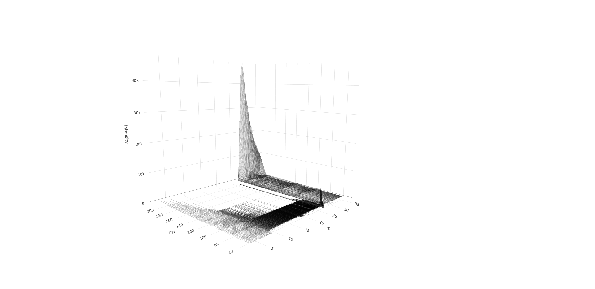
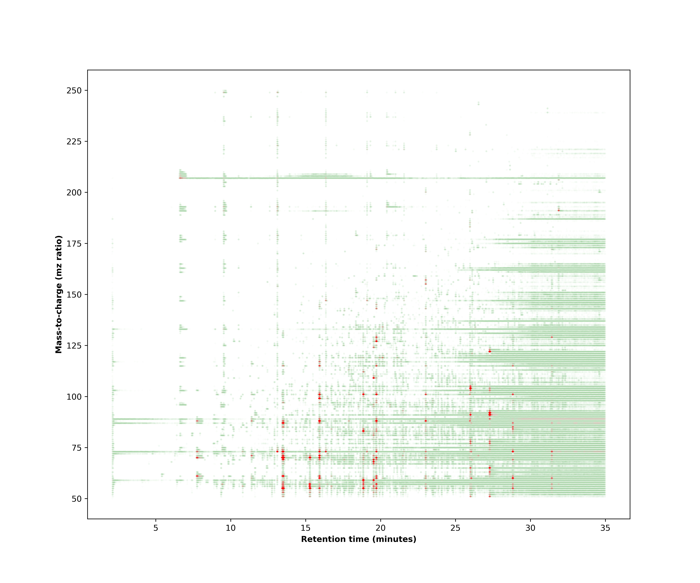

# Chromatographic-data

## Introduction
Documents short codes for small chromatography related tasks such as reading and visualizing raw data files for mass spec, UV, and fluorescence data. 
Chromatographic data is often produced in batches of large data files. This can be contained in .aia formats containg one or multiple cdf files.
The first section will be reading our data files and then exploring them. This will be followed by multivariate analysis on seperate spectra, combined spectra, and using [bioconductor bioinformatics libraries](https://bioconductor.org/packages/3.8/bioc/html/xcms.html).

## Section 1: [Batch reading and plotting GC-MS/MS data from cdf files](https://github.com/mpho-mafata/Chromatographic-data/blob/main/1.%20Batch%20reading%20and%20plotting%20GCMSMS%20raw%20files.md)

In this section we read our data files in batches using tidy language (*__tidyverse__*). Then we use *__RNetcdf__* and *__ncdf4__* libraries to read out data files.
Then we have a look at our spectra using *__ggplot2__*. __The input dataframe for retension time has 13,048 to 13,049 variables while the mass-to-charge has from 268,633 to 778,091 variables__.

<table>
 <tr>
<td>
  
  
  <figcaption>Total ion count (TIC) chromatogram overlay of 90 samples.</figcaption>
</td>

<td>
  
  
   <figcaption>Mass-to-charge (mz) chromatogram overlay of 90 samples.</figcaption>
</td>
 </tr>
</table>

## Section 2: [Multivariate Analysis: Comparing the difference between retention time and mass-to-charge profiles](https://github.com/mpho-mafata/Chromatographic-data/blob/main/2.%20Multivariate%20analysis%20of%20RT%20and%20MZ%20data.md)

In this section we look at the different profiles we get from the two sets of extracted data using principal component analysis(PCA). __The retention time spectra has 249,361 variables while the mass-to-charge has 3385 variables__.

<table>
 <tr>
<td>
  
  
  <figcaption>Prinicpal component analysis (PCA) scores plot of retention time spectra of 90 beer samples.</figcaption>
</td>

<td>
  
  
   <figcaption>Prinicpal component analysis (PCA) scores plot of mas-to-charge spectra of 90 beer samples.</figcaption>
</td>
 </tr>
</table>

## Section 3: [Collating the chromatogram and mass spectra](https://github.com/mpho-mafata/Chromatographic-data/blob/main/3.Collating%20the%20chromatogram%20and%20the%20mass%20spectrum.md)
In this section we collate the retention time chromatogram and the mass spectrum for a complete profile. For this we use the variable *__point_count__* which has a list of the number of mass points detected at a given time (*__scan_acquisition_time__*). The code is available in [python](https://github.com/mpho-mafata/Chromatographic-data/blob/main/Chromatography.ipynb) and [R language](https://github.com/mpho-mafata/Chromatographic-data/blob/main/chromatography.R).

<table>
 <tr>
<td>
  
  
  <figcaption>3D Collated chromatogram and mass spectrum.</figcaption>
</td>

<td>
  
  
   <figcaption>2D Collated chromatogram and mass spectrum.</figcaption>
</td>
 </tr>
</table>

  
